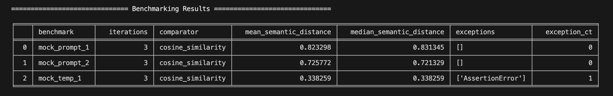

# semtest
Enables semantic testing of LLM responses and benchmarking against result expectations.


## Functionality
semtest supports the semantic benchmarking process through the following:

1. Embedding vector generation against expected result set for a given input -> output expectation
2. Execution of inputs against a given model
3. Collection of llm responses for the given input
4. Analysis of embedding vector difference of the LLM response and the expectation


## Core Requirements
Executing benchmarks requires OpenAI configuration variables defined in a .env file in order to generate required embeddings
- `OPENAI_API_KEY="..."`
- `BASE_URL="https://api.openai.com/v1"`
- `DEFAULT_EMBEDDING_MODEL="text-embedding-3-large"`

The latter two are defaulted to the values specified above.


## Benchmarking in direct (non-framework) mode

Full example of this can be found in `examples/benchmarking_example.ipynb`.

To utilize this benchmarking, the `@semtest.benchmark` decorator can be used manually to execute a given function and obtain a series of results and distances from expected semantics.

Example
```python
import semtest

expected_semantics = "A dog is in the background of the photograph"

@semtest.benchmark(
    semantic_expectation=expected_semantics,
    iterations=3
)
def mock_prompt_benchmark():
    """Mock example of benchmarking functionality."""

    # intermediary logic ...

    mocked_llm_response = query_llm(...)  # example llm autocomplete response

    return mocked_llm_response  # return LLM string response for benchmarking

res: semtest.Benchmark = mock_prompt_benchmark()  # manually executed benchmark (non-framework mode)

print(res.benchmarks())
```

Output
```json
{
  "func": "mock_prompt_benchmark_prompt_2",
  "iterations": 3,
  "comparator": "cosine_similarity",
  "expectation_input": "A dog is in the background of the photograph",
  "benchmarks": {
    "responses": [
      "In the background of the photograph there is a furry animal",
      "In the foreground there is a human, and I see a dog in the background of the photograph",
      "There are two dogs in the background of the image"
    ],
    "exceptions": [],
    "semantic_distances": [
      0.7213289868782804,
      0.7029974291193597,
      0.7529891407174136
    ],
    "mean_semantic_distance": 0.7257718522383513,
    "median_semantic_distance": 0.7213289868782804
  }
}

```

## Benchmarking in framework mode
Framework mode allows you to execute a series of prepared tests from a directory, similar to other testing frameworks (pyest, etc). Framework mode follows the same rules as direct execution mode as above, but with a few modifications, as the engine executes your tests (you do not call the benchmarks directly)

Running in framework mode is done with the following command: `semtest <your_directory>`

Due to it's automated nature, outputs are currently standardize to CLI where a dataframe is generated and output to the CLI. Additional options for data retrieval will be added later.

__Framework mode requires:__
- A test directory with .py files containing your semtest.benchmark definitions
- Each benchmark should return the llm response string you want to gauge (or a modified version of it)

See `example_benchmarks` directory for an example on structuring your semantic benchmarks. Example is runnable with `semtest example_benchmarks`.

__Benchmark report:__


More granular benchmark-level output details are available within the CLI interface.

Caveats: 
- Framework mode does not currenty support fixtures
- No relative imports within test directories due to treating every file as a top-level module


## Ongoing features
- Fixture support for framework mode
- Support for Azure OpenAI embeddings
- Support for multiple result output formats (non-CLI)
- Allow for parameterization of benchmarks with multiple I/O expectations
- Implement LLM response schema validation via Pydantic
